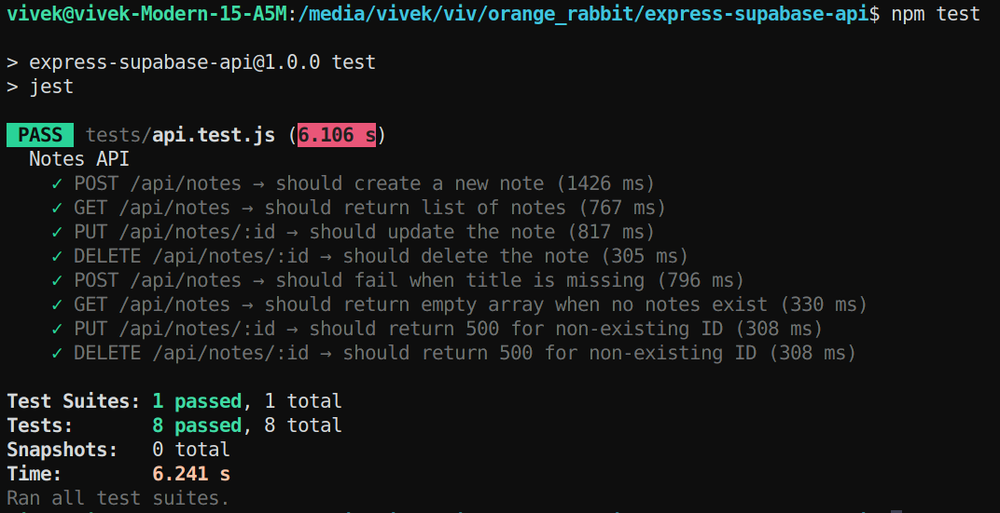
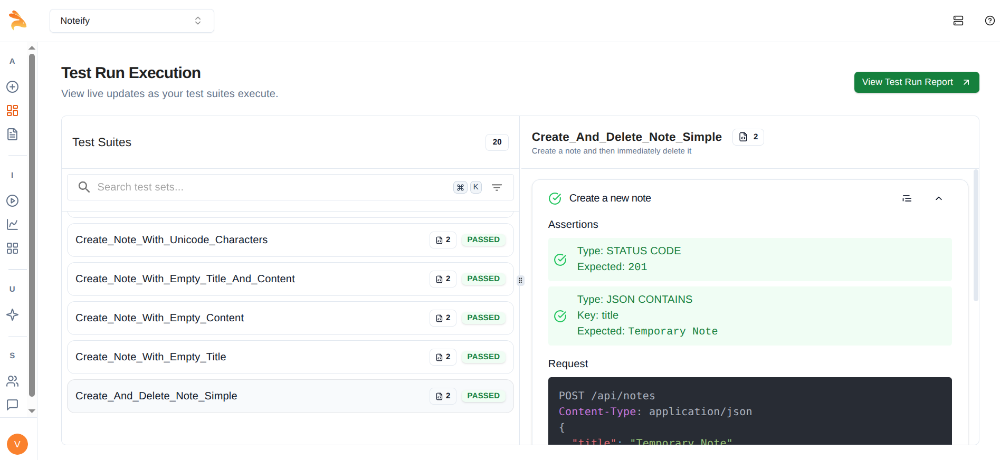

# 📘 express-supabase-api

A simple, serverless Express.js API powered by Supabase PostgreSQL and deployed on Vercel. This project demonstrates how to build and deploy a custom backend with CRUD functionality using modern tools and infrastructure.

---

## 🚀 Features

- ✅ RESTful API built with Express.js
- ✅ PostgreSQL database via Supabase
- ✅ Serverless deployment with Vercel
- ✅ CRUD operations for managing notes
- ✅ Environment-based configuration for security

---

## 🧱 Tech Stack

- **Backend Framework**: Express.js
- **Database**: Supabase (PostgreSQL)
- **Hosting**: Vercel Serverless Functions
- **Environment Management**: `.env` + Vercel Secrets

---

## 📂 Project Structure

```
express-supabase-api/
    ├── api/
    │   └── index.js             ← Express server with all endpoints
    |   node_modules
    |   tests
    |   └── api.test.js          ← Test cases
    ├── .env                     ← Environment variables
    ├── api_docs.md              ← API documentation
    ├── docs.md                  ← Project documentation
    ├── package.json
    ├── README.md
    └── vercel.json              ← Vercel serverless config

```

---

## 📦 Setup & Installation

### 1. Clone the Repository

```bash
git clone https://github.com/your-username/express-supabase-api.git
cd express-supabase-api
```

### 2. Install Dependencies

```bash
npm install
```

### 3. Set Up Environment Variables

Create a .env file and add your Supabase project details:

```env
SUPABASE_URL=https://your-project.supabase.co
SUPABASE_KEY=your-service-role-key
```

### 4. Run Locally

```bash
node api/index.js
# or
npm run dev

Visit: http://localhost:3000/api/notes
```

### 5. Run tests

Jest + Supertest for testing the code. Run the following command to run tests locally.

```bash
npm test
```

Sample Output:

```bash
> express-supabase-api@1.0.0 test
> jest

 PASS  tests/api.test.js (6.106 s)
  Notes API
    ✓ POST /api/notes → should create a new note (1426 ms)
    ✓ GET /api/notes → should return list of notes (767 ms)
    ✓ PUT /api/notes/:id → should update the note (817 ms)
    ✓ DELETE /api/notes/:id → should delete the note (305 ms)
    ✓ POST /api/notes → should fail when title is missing (796 ms)
    ✓ GET /api/notes → should return empty array when no notes exist (330 ms)
    ✓ PUT /api/notes/:id → should return 500 for non-existing ID (308 ms)
    ✓ DELETE /api/notes/:id → should return 500 for non-existing ID (308 ms)

Test Suites: 1 passed, 1 total
Tests:       8 passed, 8 total
Snapshots:   0 total
Time:        6.241 s
Ran all test suites.
```



## Keploy API Testing Platform results


